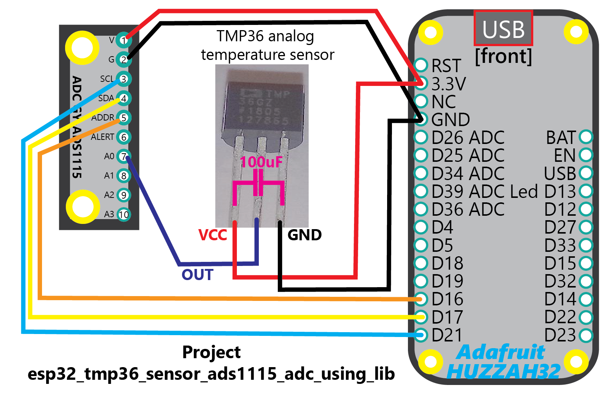

## Project Description
This project demonstrates the components mjd_ads1115 and mjd_tmp36. The mjd_ads1115 component for the TI ADS1115 Analog-To-Digital-Convertor is used to read the voltage output of the analog temperature sensor. The mjd_tmp36 component for the TMP36 sensor is used to convert the raw voltage reading of the ADC to the ambient temperature in Degrees Celsius transparently.

The Gain of the ADC is set to 2.048V to achieve a higher accuracy of the voltage readings (the default of the mjd_ads1115 component is 4.096V). The 2.048V covers the maximum voltage of the TMP36 sensor of 1.75V for +-125 Degrees Celsius (maximum temperature).

Go to the component directory "components/mjd_tmp36" for more documentation, suggested breakout boards (if relevant), installation and wiring instructions, data sheets, FAQ, photo's, etc.

Go to the component directory "components/mjd_ads1115" for more documentation, suggested breakout boards (if relevant), installation and wiring instructions, data sheets, FAQ, photo's, etc.


## What are the HW SW requirements of the ESP32 MJD Starter Kit?

### Hardware

- A decent ESP development board. I suggest to buy a popular development board with good technical documentation and a significant user base. Examples: [Adafruit HUZZAH32](https://www.adafruit.com/product/3405),  [Espressif ESP32-DevKitC](http://espressif.com/en/products/hardware/esp32-devkitc/overview), [Pycom WiPy](https://pycom.io/hardware/), [Wemos D32](https://wiki.wemos.cc/products:d32:d32).
- The peripherals that are used in the project.
  @tip The README of each component contains a section "Shop Products".
  @example A Bosch BME280 meteo sensor breakout board.

### Software: ESP-IDF v3.2

- A working installation of the **Espressif ESP-IDF *V3.2* development framework**** (detailed instructions @ http://esp-idf.readthedocs.io/en/latest/get-started/index.html).

```
mkdir ~/esp
cd    ~/esp
git clone -b v3.3 --recursive https://github.com/espressif/esp-idf.git esp-idf-v3.2
```

- A C language editor or the Eclipse IDE CDT (instructions also @ http://esp-idf.readthedocs.io/en/latest/get-started/index.html).


## Lab Setup


## Wiring Diagram
```
TMP36 SENSOR PIN LAYOUT:

PIN#  PIN NAME	  Description
----  ----------  -----------
 1    VCC         Power supply (3.3V for the ESP32)
 2    VOUT        Voltage Output
 3    GND         Ground
```



```
WIRING DIAGRAM: ADS1115 - MCU:

ADS1115 PIN  MCU PIN#
-----------  -------
V VCC        VCC 3.3V
G GND        GND
SCL          GPIO#21
SDA          GPIO#17
ADDR         --
ALR/RDY      GPIOI#16
```


```
WIRING DIAGRAM: TMP36 - MCU:

TMP36 PIN#  PIN NAME  MCU PIN#
----------  --------  -----------
         1  VCC       GPIO#21
         2  VOUT      VCC 3.3V
         3  GND       GND
```


## Running the example

- Run `make menuconfig` and modify the GPIO PIN#'s that you want to use in the section "MY PROJECT CONFIGURATION". @tip You can also change the log level in Components->Logging: use level INFO for normal operation, use level DEBUG for more detailed logging and to get insights in what the component is actually doing.
- Run `make flash monitor` to build and upload the example to your board and connect to its serial terminal.


## An extract of the UART Debugging Output

```
...
I (349) mjd: *** 19700101000000 Thu Jan  1 00:00:00 1970
I (359) myapp: @tip You can also change the log level to DEBUG for more detailed logging and to get insights in what the component is actually doing.
I (369) myapp: @doc Wait 2 seconds after power-on (start logic analyzer, let peripherals become active, ...)
I (2379) myapp: OK Task has been created, and is running right now
I (2379) myapp: app_main() END
I (2379) gpio: GPIO[13]| InputEn: 0| OutputEn: 1| OpenDrain: 0| Pullup: 0| Pulldown: 0| Intr:0
I (2379) myapp: do mjd_ads1115_init()
I (2399) gpio: GPIO[16]| InputEn: 1| OutputEn: 0| OpenDrain: 0| Pullup: 1| Pulldown: 0| Intr:0
I (2399) mjd_ads1115: ADS1115 Log Device Params (*Read again from registers*):
I (2419) mjd_ads1115:   OPSTATUS:    0x1 0b00000001 (1)
I (2419) mjd_ads1115:   MUX:         0x4 0b00000100 (4)
I (2419) mjd_ads1115:   PGA:         0x2 0b00000010 (2)
I (2419) mjd_ads1115:   OPMODE:      0x1 0b00000001 (1)
I (2429) mjd_ads1115:   DATARATE:    0x0 0b00000000 (0)
I (2439) mjd_ads1115:   COMPARATORMODE:     0x0 0b00000000 (0)
I (2439) mjd_ads1115:   COMPARATORPOLARITY: 0x0 0b00000000 (0)
I (2449) mjd_ads1115:   LATCHINGCOMPARATOR: 0x0 0b00000000 (0)
I (2449) mjd_ads1115:   COMPARATORQUEUE:    0x2 0b00000010 (2)
I (2459) mjd_ads1115:   LOWTHRESHOLD:  0x0 0b0000000000000000 (0)
I (2469) mjd_ads1115:   HIGHTHRESHOLD: 0xFFFF 0b1111111111111111 (65535)
I (2479) mjd_ads1115:   CONVERSIONREADYPININLOWREG: 0x0 0b00000000 (0)
I (2479) mjd_ads1115:   CONVERSIONREADYPININLOWREG: 0x1 0b00000001 (1)
I (2489) mjd_tmp36: TMP36 Analog Temperature Sensor: config:
I (2499) mjd_tmp36:   _offset_volts:                   0.500000
I (2499) mjd_tmp36:   _scale_degrees_celsius_per_volt: 0.010000
I (2509) mjd: *** 19700101000002 Thu Jan  1 00:00:02 1970
I (2519) myapp: TMP36 Measurements via the ADS1115 ADC
I (2519) myapp: LOOP: NBR_OF_RUNS 1000
I (2529) myapp: ***Measurement#1
I (2669) myapp:   TMP36: 22.052 Degrees Celsius | ADC Pin A0: raw_value (signed int16): 11528 | volt_value (float): 0.721
I (2669) myapp: ***Measurement#2
I (2809) myapp:   TMP36: 22.065 Degrees Celsius | ADC Pin A0: raw_value (signed int16): 11530 | volt_value (float): 0.721
I (2809) myapp: ***Measurement#3
I (2949) myapp:   TMP36: 22.121 Degrees Celsius | ADC Pin A0: raw_value (signed int16): 11539 | volt_value (float): 0.721

...
I (142249) myapp:   TMP36: 21.952 Degrees Celsius | ADC Pin A0: raw_value (signed int16): 11512 | volt_value (float): 0.720
I (142249) myapp: ***Measurement#999
I (142389) myapp:   TMP36: 21.933 Degrees Celsius | ADC Pin A0: raw_value (signed int16): 11509 | volt_value (float): 0.719
I (142389) myapp: ***Measurement#1000
I (142529) myapp:   TMP36: 21.965 Degrees Celsius | ADC Pin A0: raw_value (signed int16): 11514 | volt_value (float): 0.720
I (142619) myapp: REPORT:
I (142629) myapp:   NBR_OF_RUNS:       1000
I (142629) myapp:   nbr_of_adc_errors: 0
I (142629) myapp:   TMP36 Temperature Readings:
I (142639) myapp:     AVG degrees_celsius  min_degrees_celsius  max_degrees_celsius
I (142649) myapp:     -------------------  -------------------  -------------------
I (142659) myapp:                  22.022               21.877               22.165
I (142669) mjd: *** 19700101000222 Thu Jan  1 00:02:22 1970
W (142669) mjd: mjd_rtos_wait_forever()
```


## Reference: the ESP32 MJD Starter Kit SDK

Do you also want to create innovative IoT projects that use the ESP32 chip, or ESP32-based modules, of the popular company Espressif? Well, I did and still do. And I hope you do too.

The objective of this well documented Starter Kit is to accelerate the development of your IoT projects for ESP32 hardware using the ESP-IDF framework from Espressif and get inspired what kind of apps you can build for ESP32 using various hardware modules.

Go to https://github.com/pantaluna/esp32-mjd-starter-kit


