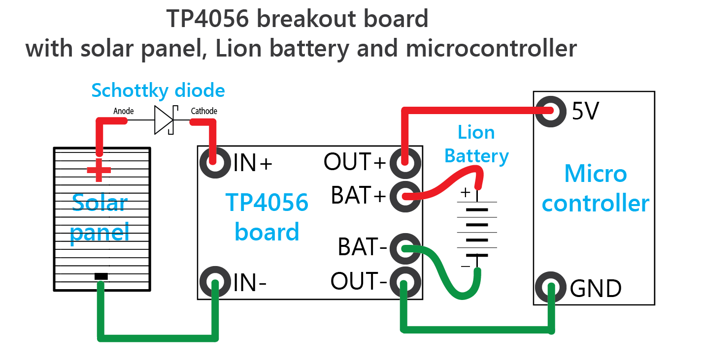

# TP4056 Lithium battery solar charging board, discharge over-current over-voltage protection

Aug2018.


## Overview

> If you are using a LOLIN D32 development board then it is easier to wire up a 3 Watt / 6 Watt 6V solar panel (**maximum 6.0V**) directly to the VUSB and GND pins (or the MicroUSB slot) and wire up the Lion battery to the JST-PH2 slot. This development board is equipped with a TP4054 battery charger which allows input voltages up to **9.0V**, and the ME6211 voltage regulator which allows input voltages up to **6.0V**. So you do not need a TP4056 breakout board and the extra wiring. https://www.youtube.com/watch?v=gcbzdtRmYrM&t=112 


This is a great board for charging 1 Lion battery, using for example a 6V solar panel or MicroUSB (smartphone charger) as input, and providing power to a microcontroller project, all at the same time. CORRECTION to the data sheet:  simultaneous charging and discharging (by the load) *is* supported!

Product Pages:

- http://www.chinalctech.com/cpzx/Programmer/Power_Module/163.html
- http://www.tp-asic.com/te_product_a/2008-04-09/2236.chtml

Red Green LED explanation

```
Charge state                Red LED     Green LED
============                =======     =========
Charging                    *ON         *OFF

Charge Terminated           *OFF        *ON

VIN too low;                *OFF        *OFF
Battery temp too low/high;
No battery;

BAT PIN Connect (?);        Flicker     *ON
10uF Capacitance (?);
```


## FAQ

- Make sure you obtain a board that contains the protection IC's (3 black IC's) and the exposed output pins "OUT+" and "OUT" to hook up the load (e.g. the microcontroller). See photo.
- The battery charger cutoff voltage is approx 4.0V.
- Input Supply Voltage according to the datasheet: 0.3V -> **8V**. It is compatible with the popular 6V solar panels. **The minimum solar input voltage is actually 4.25V** before the board starts charging the battery.
- What is the voltage at the OUT+ pin?

  - When the solar panel generates more than 4.25V (and it charges the battery) then it is the solar panel output voltage minus 1V.
  - When the solar panel generates less than 4.25V (and it does not charge the battery) then it is the battery voltage (typically between 2.5V and 4.2V).


## PCB
- TP4056 ST291P battery charger IC (largest chip).
- FS8205A Dual N Channel Power MOSFET (second largest chip).
- DW01A one-cell Lion battery protection IC (third largest chip).


## Wiring Diagram

Check the images.

The OUT- output pin must be connected to the GND pin of the microcontroller (the load).

The OUT+ output pin must be connected to the 5V pin of the microcontroller.

> If you need an output voltage of 3.3V then place a LDO 3.3V voltage regulator between the output pin OUT+ of the TP4056 board and the 3.3V pin of the microcontroller (not shown in the image). A good LDO IC is the Nanjing Micro One Elec ME6210A33PG SOT-89-3 Low Dropout Regulator Positive Fixed 260mV @ 200mA 18V 3.3V 500mA. The SMD package SOT89-3 can be soldered easily by hand.





## Spiess tutorial videos:

PLAYLIST "Solar Power for Small Devices" https://www.youtube.com/playlist?list=PL3XBzmAj53Rl6hxunDxEm4V98qK_75g-m

- ID #142 Solar Power for the ESP8266, Arduino, etc. https://www.youtube.com/watch?v=WdP4nVQX-j0&index=4&list=PL3XBzmAj53Rl6hxunDxEm4V98qK_75g-m

- ID #154 Solar Charger for Microcontrollers  https://www.youtube.com/watch?v=dBx-g1dkdDQ

- ID #155 The 5 Best Solar Charger Boards for Arduino and ESP8266 https://www.youtube.com/watch?v=ttyKZnVzic4

- ID #183 How to select voltage regulators for small projects? (ESP8266, ESP32, Arduino) https://www.youtube.com/watch?v=ffLU7PSuI5k&index=1&list=PL3XBzmAj53Rl6hxunDxEm4V98qK_75g-m


## What could be improved?

- The battery charger stops when the battery is at 4.0V (4.2V would have been better).
- Cannot be used for Lion batteries with a capacity lower than 1000mAh. The board contains a soldered RPROG 1.2KOhm which charges the battery at 1Amp which is too much for Lion batteries with a low capacity. For 1000mAh batteries you need to solder another resistor (see the datasheet for the resistor value and the corresponding charging power).
- Many TP4056 chips are **fake** and are potentially not working. The fake ones do not have the original logo resembling a "F". Please check at least one full charge cycle with your board/IC to verify it works correctly. Note:  do not use a protected battery for this test as it would protect the cell anyway.
- Cannot be used to charge LiFePO4 batteries.


